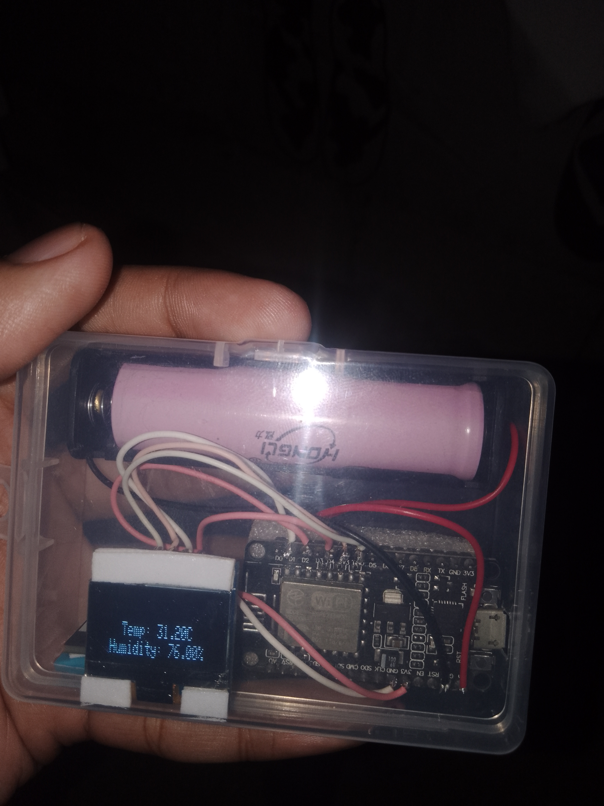
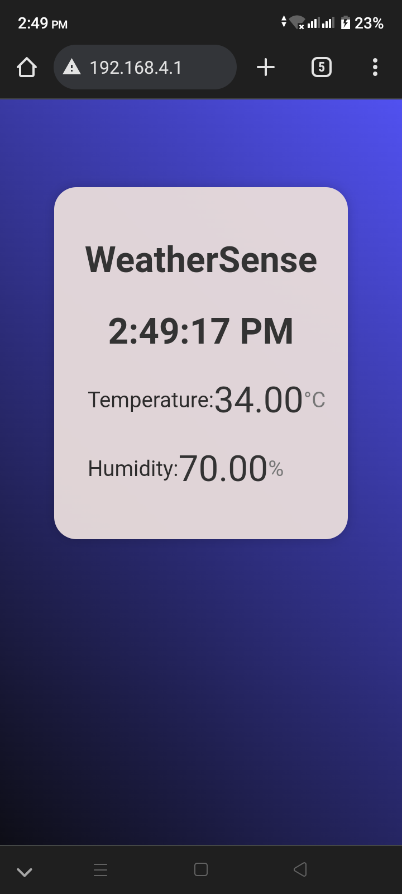

# WeatherSense IoT Weather Station

WeatherSense IoT Weather Station is project that uses an ESP8266 to measure and display temperature and humidity readings from a DHT11 sensor. The project also includes a Oled Display and web interface for real-time monitoring of the weather data.
# Station Mode
  

  

# Access Point Mode
   
  

  
  

# Features
- With OLED Display
- Measures and displays temperature in degrees Celsius.
- Measures and displays humidity as a percentage.
- Real-time digital clock display.
- Web interface for monitoring temperature and humidity remotely.

# Hardware Requirements
- ESP8266 WiFi module
- OLED
- DHT11 temperature and humidity sensor
- Arduino IDE (or compatible software)
- USB cable for programming and power
## License
This project is open-source and available under the MIT License. See the [LICENSE](LICENSE) file for more details.
