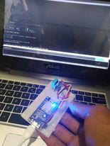

# WeatherSense IoT Weather Station

## This is my Arduino-based IoT weather station project that uses an ESP8266 WiFi module to measure and display temperature and humidity readings from a DHT11 sensor. The project also includes a web interface for real-time monitoring of the weather data.

# Features
- Measures and displays temperature in degrees Celsius.
- Measures and displays humidity as a percentage.
- Real-time digital clock display.
- Web interface for monitoring temperature and humidity remotely.

# Hardware Requirements
- ESP8266 WiFi module
- DHT11 temperature and humidity sensor
- Arduino IDE (or compatible software)
- USB cable for programming and power
